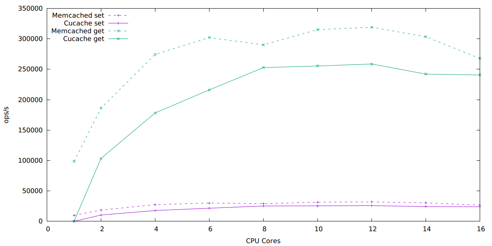

```
ben$ uname -a
Linux ben 3.16-2-amd64 #1 SMP Debian 3.16.3-2 (2014-09-20) x86_64 GNU/Linux
ben$ lscpu
Architecture:          x86_64
CPU op-mode(s):        32-bit, 64-bit
Byte Order:            Little Endian
CPU(s):                40
On-line CPU(s) list:   0-39
Thread(s) per core:    1
Core(s) per socket:    10
Socket(s):             4
NUMA node(s):          4
Vendor ID:             GenuineIntel
CPU family:            6
Model:                 47
Stepping:              2
CPU MHz:               1064.000
BogoMIPS:              4800.31
Virtualization:        VT-x
L1d cache:             32K
L1i cache:             32K
L2 cache:              256K
L3 cache:              30720K
NUMA node0 CPU(s):     0-9
NUMA node1 CPU(s):     10-19
NUMA node2 CPU(s):     20-29
NUMA node3 CPU(s):     30-39
```

Server is run on the first 16 cores, clients on remaining cores.
The graph likely flattens out as the clients on ben are not able to
produce enough work to saturate all the server cores.


