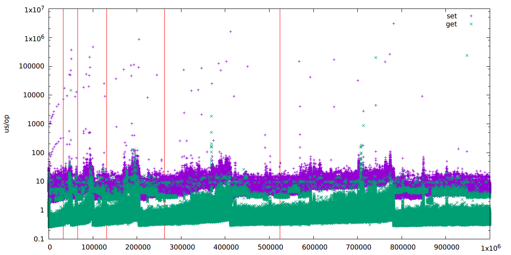

These benchmarks do not use the loopback network interface, nor any of
the Memcache protocols. Instead, functions are called directly on the
cuckoo cache by the [benchmarking
tool](../../src/cuckood/bench/main.go). A tight loop performs a set and
a get on a random key for each iteration, and the time spent on the set
and get are plotted.

Red lines indicate the size steps for the Cuckoo hash table. The
duration of sets/gets increases over time as the number of hashing
functions increases, and then drops back down when the table is resized
and the number of hashes is lowered. Note that the occupancy of the
hash table only ever grows to ~85%; increasing the number of hash
functions or the max search depth is likely to improve this.

Three "steps" of set durations are visible in the graph. The bulk of the
sets take on the order of tens of microseconds, and correspond to the
common case where the table can accommodate the new item. The sets
taking on the order of tens of thousands of microseconds are those that
increase the number of hash functions used by the table. This is
expensive partially because of the CompareAndSwap on the number of
hashes, and partially due to the following second insert that needs to
be performed. The sets on the order of a second are those that perform a
table resize, which is a fairly expensive operation.

Two steps of get durations are visible. The bulk of them take on the
order of a microsecond, but some edge up towards 10us. I'm not sure why
this second step exists.. Gets are dominated by calls to cuckood.has(),
GC, and malloc.
