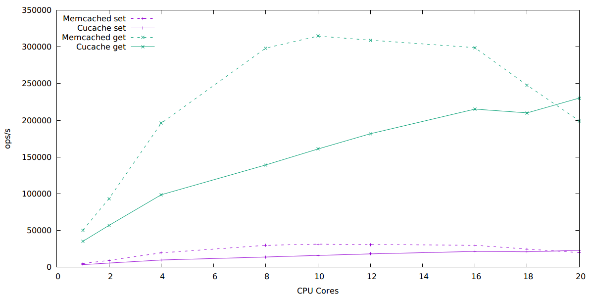

```
tom$ uname -a
Linux tom 3.13.0+ #1 SMP Fri Sep 12 19:16:24 EDT 2014 x86_64 GNU/Linux
tom$ lscpu
Architecture:          x86_64
CPU op-mode(s):        32-bit, 64-bit
Byte Order:            Little Endian
CPU(s):                48
On-line CPU(s) list:   0-47
Thread(s) per core:    1
Core(s) per socket:    6
Socket(s):             8
NUMA node(s):          8
Vendor ID:             AuthenticAMD
CPU family:            16
Model:                 8
Stepping:              0
CPU MHz:               2411.075
BogoMIPS:              4822.71
Virtualization:        AMD-V
L1d cache:             64K
L1i cache:             64K
L2 cache:              512K
L3 cache:              5118K
NUMA node0 CPU(s):     0-5
NUMA node1 CPU(s):     6-11
NUMA node2 CPU(s):     12-17
NUMA node3 CPU(s):     18-23
NUMA node4 CPU(s):     24-29
NUMA node5 CPU(s):     30-35
NUMA node6 CPU(s):     36-41
NUMA node7 CPU(s):     42-47
```

Server is run on the first 20 cores, clients on remaining cores.


